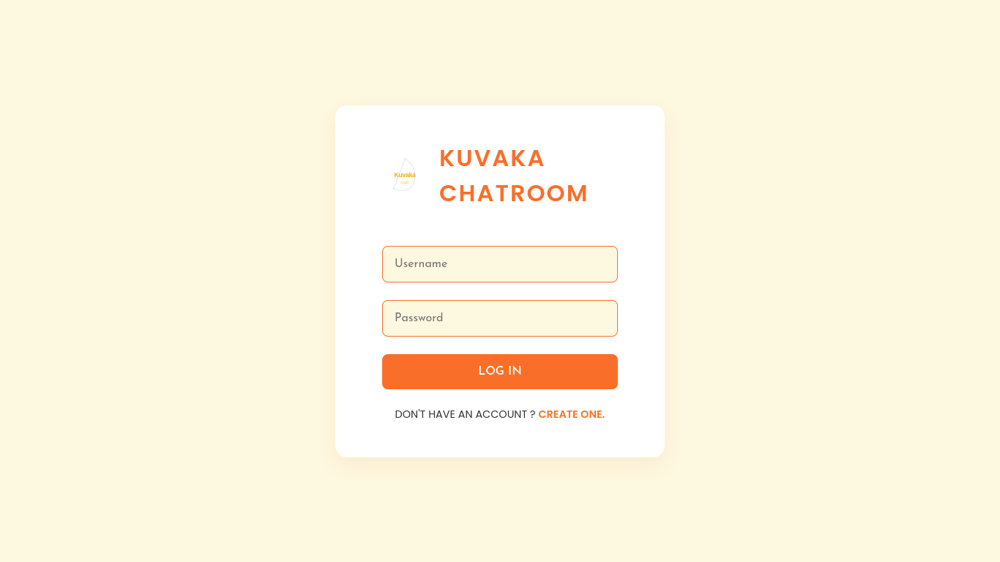
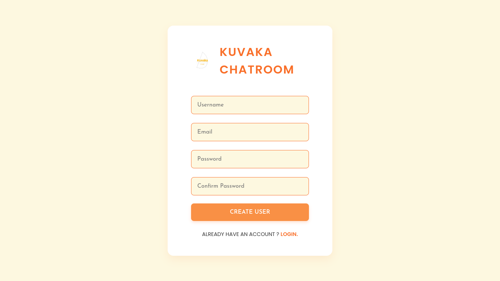

# Kuvaka Chatroom 🚀💬

## Overview
Kuvaka Chatroom is a full-stack real-time chat application built using the MERN (MongoDB, Express, React, Node.js) stack. It provides a seamless messaging experience with features like user authentication, avatar selection, and real-time communication.

## Features ✨
- User Registration and Authentication
- Real-time Messaging
- Emoji Support
- Avatar Customization
- Responsive Design

## Screenshots 📸




## Prerequisites 📋
Before you begin, ensure you have the following installed:
- [Node.js](https://nodejs.org/en/download) (v14 or later)
- [MongoDB](https://www.mongodb.com/docs/manual/administration/install-community/)
- [Yarn](https://yarnpkg.com/getting-started/install) (Recommended package manager)

## Architecture 🏗️
### Technology Stack
- **Frontend**: React.js
- **Backend**: Node.js, Express.js
- **Database**: MongoDB
- **Real-time Communication**: Socket.io
- **State Management**: Local Storage
- **Styling**: Styled Components

### Concurrency Handling
- Socket.io manages real-time bidirectional communication between clients and server
- Backend uses a global `onlineUsers` map to track active user connections
- Messages are broadcasted efficiently using socket events

## Installation Methods 🛠️

### Method 1: Manual Setup

1. Clone the repository
```bash
git clone https://github.com/Vinay-cyrpto/kuvaka-chatroom
cd kuvaka-chatroom
```

2. Configure Environment Variables
```bash
cd public
mv .env.example .env
cd ..
cd server
mv .env.example .env
```

3. Install Dependencies
```bash
cd server
yarn install
cd ../public
yarn install
```

4. Start Applications
- In one terminal (Backend):
```bash
cd server
yarn start
```
- In another terminal (Frontend):
```bash
cd public
yarn start
```

### Method 2: Docker Compose
Requires Docker and Docker Compose installed.

1. Build Containers
```bash
docker compose build --no-cache
```

2. Start Containers
```bash
docker compose up
```

## Configuration 🔧
Key configuration files:
- `.env` in `server/`: Backend configuration
- `.env` in `public/`: Frontend configuration
- Supports customizable MongoDB connections

## Deployment 🌐
### Deployed Instances
- Frontend: https://kuvaka-chatroom.vercel.app
- Backend: https://kuvaka-chatroom.onrender.com

## Design Choices and Assumptions 💡

### Authentication
- Password hashing using bcrypt for security
- JWT not implemented (uses local storage)
- 8-character minimum password length

### Avatar Selection
- Uses MultiAvatar API for random avatar generation
- Users required to select an avatar during registration

### Messaging
- Real-time communication via Socket.io
- Messages stored in MongoDB
- No message encryption implemented

## Security Considerations 🔒
- bcrypt for password hashing
- CORS configured
- Environment-based configuration
- Basic input validation

## Contributing 🤝
1. Fork the repository
2. Create your feature branch (`git checkout -b feature/AmazingFeature`)
3. Commit your changes (`git commit -m 'Add some AmazingFeature'`)
4. Push to the branch (`git push origin feature/AmazingFeature`)
5. Open a Pull Request

## License 📄
Distributed under the MIT License.

## Contact 📧
Vinay Patel - vinaypatelknw@gmail.com

Project Link: https://github.com/Vinay-cyrpto/kuvaka-chatroom
